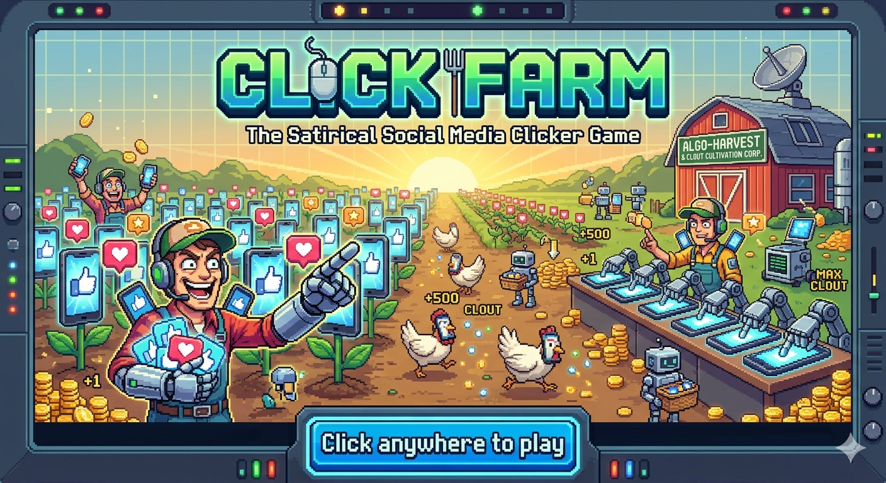
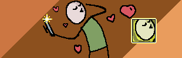
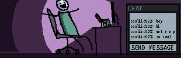
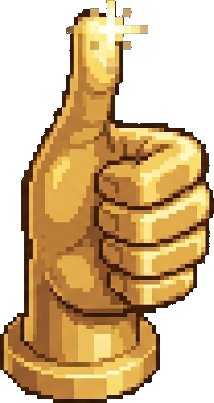

<p align="center">
  
</p>

<h1 align="center">Click Farm</h1>
<h3 align="center">Grow your fame. Lose your soul. Tap anyway.</h3>

<p align="center">
  <a href="https://click-farm.barelyconscious.games/">Play it now</a>
</p>

---

Click Farm is a satirical social media clicker game. You start as a nobody posting chirps into the void. You end as an algorithmic prophet whose AI-generated deepfakes print engagement while you sleep.

The journey between those two points is the joke — and the game.

<p align="center">
  
  
  
  
  
</p>

## How it works

**Tap to post.** Each tap earns engagement. Engagement converts to followers. Followers unlock new platforms.

**Hire your army.** Buy autoclickers that tap for you. Watch your verb buttons fire off on their own. Your hand is always faster — but your army adds up.

**Level up.** Speed upgrades make you tap faster. Power upgrades make every tap hit harder. Each investment axis feels different.

**Grow across platforms.** Manage followers on Chirper, PicShift, Skroll, and PodPod. Each platform has its own audience and its own rewards.

**Rebrand.** When you've grown enough, wipe everything and start over — but keep Clout. Clout buys permanent upgrades that make your next run faster, stranger, and more absurd.

**Ascend the content ladder.** Chirps become selfies become livestreams become podcasts become viral stunts. Then things get weird: AI Slop, Deepfakes of Yourself, Algorithmic Prophecy. The numbers stop making sense. That's the point.

## The feel

Click Farm is an idle/clicker game that plays like an arcade cabinet and reads like a satire. The tone is affectionate, not cruel — the game laughs at the creator economy, not at you. Every mechanic is honest, every number is real, and you can quit whenever you want.

No ads. No microtransactions. No daily login rewards. No dark patterns. Just clicks.

<p align="center">
  
</p>

## Tech

Vite + React + TypeScript. Runs entirely in your browser. Game state persists to localStorage — no server, no account, no sign-up.

## Development

```bash
cd client
npm install
npm run dev
```

Tests:
```bash
npm test
```

## License

All rights reserved.
